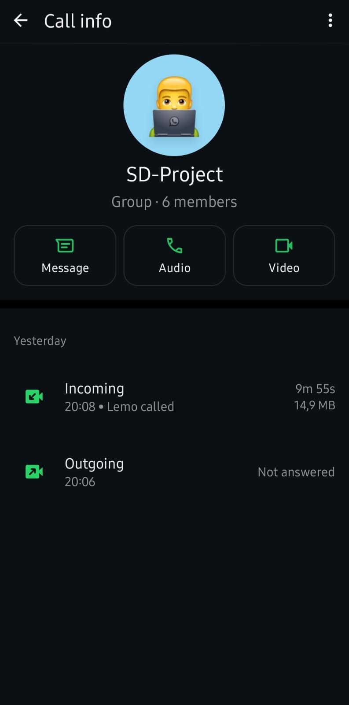

# Scrum 4

## Objectives

1. Implement login authentication
2. Develop Freelancer, Admin, and Client dashboards
3. Identify and resolve blockers

## Implement Login Authentication

Login authentication was partially implemented using Auth0.

### Progress:
- Auth0 integration completed
- JWT tokens with role claims are working
- Basic post-login redirect is functional

### Blockers:
- Role-based redirection is inconsistent
- Need to verify token claims and `appState` flow

## Develop Freelancer Dashboard

The Freelancer dashboard is fully functional.

### Progress:
- UI completed
- Crash-on-load issue fixed

### Next Steps:
- Finalize API integrations

## Develop Admin Dashboard

The Admin dashboard is in development (70% done).

### Progress:
- Core UI components implemented
- Basic admin features are working

### Blockers:
- Needs API integration
- Not yet merged to the main repo

## Develop Client Dashboard

The Client dashboard is in development (60% done).

### Progress:
- Main UI structure completed
- Basic features working

## Blockers Needing Resolution

- Role-based redirection issue using Auth0
   - Action: Verify token role claims and fix `loginWithRedirect` state handling
- API integrations for Admin and Client dashboards
- Clarify Auth0 role-mapping logic
- Confirm backend API stability

## Priority Focus

- Fix Auth0 routing issues
- Finalize and merge dashboards
- Improve test coverage

## Overall Status

On Track – Minor Blockers

## Evidence

