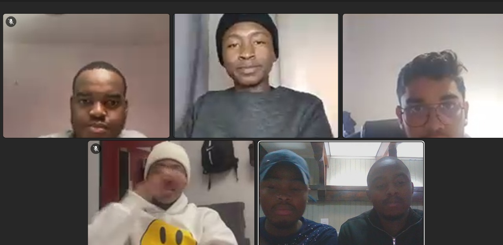

# Sprint 2 - Scrum 1

## Objectives

1. Revisit Sprint 1 outcomes  
2. Outline Sprint 2 goals  
3. Assign tasks based on team capacity and backlog priority  
4. Set up development and testing goals  

---

## Sprint Review & Task Assignment

The team reflected on the achievements and blockers from Sprint 1. Most features were partially implemented or still under development, so for Sprint 2 the focus shifted to feature completion, testing, database setup, and communication functionality.

**Task Assignments:**

- **Lebo** – Job posting (Create, Delete, Mark as Tracked) + Implement testing using Jest  
- **Lemohang** – Add functionality to the "Message" button → opens WhatsApp  
- **Bhavan** – Implement working search bar and freelancer filtering by price  
- **Kagiso** – Develop required APIs for frontend integration  
- **Kgaugelo** – Design and finalize UML diagrams for system architecture  
- **Dimpho** – Create and connect database to the frontend system  

---

## Highlights

- Reviewed client expectations for core features  
- Reprioritized backlog with testing and database integration now in focus  
- Assigned tasks that align with members' current modules to streamline development  

---

## Infrastructure & Setup Notes

- Database schema discussion initiated  
- Planning for post-implementation test runs with Jest  
- Final UML adjustments will be made in parallel with development  

---

## Initial Considerations / Risks

- Integration between frontend and new APIs could introduce delays  
- WhatsApp redirection behavior needs device/browser testing  
- Search and filter logic may need refinement for optimal user experience  

---

## Status

**Planning Complete — Development phase underway**

## Evidence

