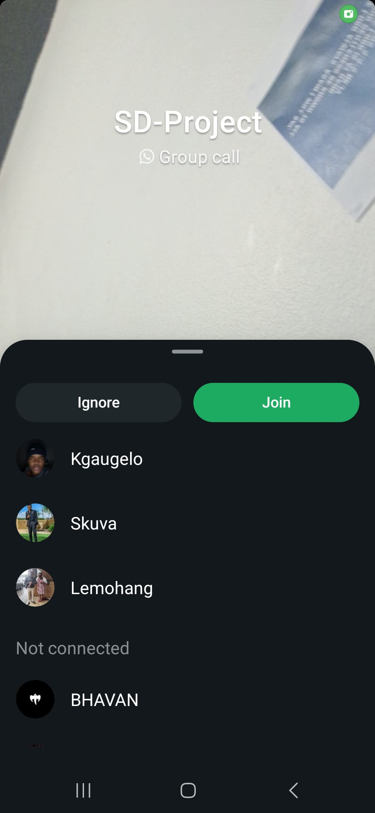

# Sprint 2 - Scrum 4

## Objectives

1. Review current sprint progress and integrate features into main branch  
2. Address final blockers before the end of the sprint  
3. Test merged features across environments (dev, staging, production)  
4. Continue monitoring CI/CD pipeline setup  

---

## Team Stand-Up Summary

### Lebo – Job Posting & Jest Testing

**Progress:**

- Completed "Mark as Tracked" and job deletion functionality  
- Expanded test suite for edge cases, all passing  

**Next:**

- Test Jest integration on CI pipeline  
- Start documenting testing strategy  

**Blockers:**

- CI pipeline still not fully integrated with Jest; needs troubleshooting assistance  

---

### Lemohang – WhatsApp Message Button

**Progress:**

- WhatsApp button working across desktop and mobile  
- Test cases successfully run across common browsers  

**Next:**

- Final testing with user accounts  

**Blockers:**

- None at the moment  

---

### Bhavan – Search Bar & Price Filter

**Progress:**

- Search bar and price filter completed with real-time results  
- Addressed responsive layout issues for smaller devices  

**Next:**

- Conduct load testing for search and filtering functionality  

**Blockers:**

- Minor issue with multi-filtering not triggering new search results  

---

### Kagiso – API Integration

**Progress:**

- Added DELETE API route for job posts  
- Secured endpoints with role-based authentication (JWT)  

**Next:**

- Finalize API documentation  

**Blockers:**

- Confusion around Auth0 token validation persists; needs review with Lemohang  

---

### Kgaugelo – UML Finalization

**Progress:**

- Final class and sequence diagrams uploaded  
- Team reviewed and signed off on diagrams  

**Next:**

- Update README with UML references and descriptions  

**Blockers:**

- None  

---

### Dimpho – Database Integration

**Progress:**

- Database schema optimized for speed  
- All major job posts are now successfully saved and retrieved  

**Next:**

- Coordinate with Kagiso to test real API calls for database entries  

**Blockers:**

- No blockers  

---

## Summary & Action Points

- Majority of functionality is working, but CI/CD issues need resolution  
- Database, API, and frontend are now fully integrated  
- Merging to main branch expected soon  
- Next sprint will focus on user testing and fine-tuning  

---

## Status

## Evidence

**On Track — Final tests and documentation updates in progress**
