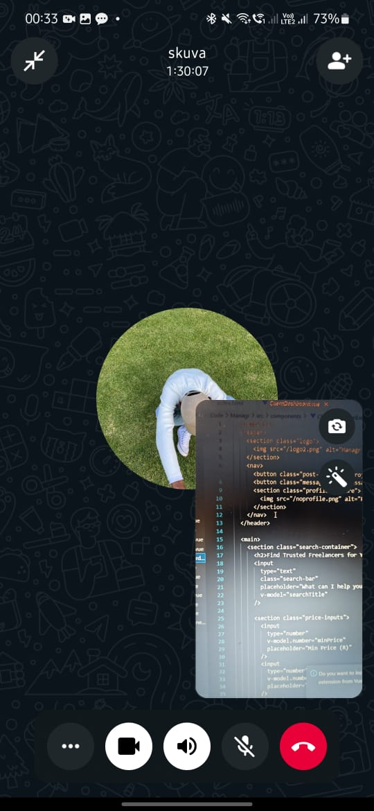

# Objectives

1. Implement messaging system  
2. Backend and frontend logic for real-time messaging  
3. Store messages with timestamps  

## Implement messaging system

Freelancers and Clients can now send messages to each other after applying for a task.

- Message UI integrated into both dashboards.
- Shows a list of ongoing conversations.

## Backend and frontend logic for real-time messaging

Used WebSockets (Socket.io) for real-time communication.

- Socket connections handled on the server.
- Messages update in real-time without needing refresh.

## Store messages with timestamps

Each message is stored in a "messages" collection.

- Fields: sender ID, receiver ID, content, and timestamp.
- Messages are retrieved sorted by time to show conversation history.

## Evidence
