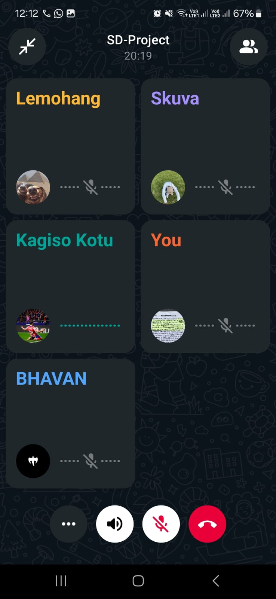

# Scrum 4

# Objectives

1. Freelancer can apply for jobs  
2. Client can see job applications  
3. Application status tracking  

## Freelancer can apply for jobs

A new "Apply" button was added to each job card seen by freelancers.

- Clicking it sends application data (freelancer ID, job ID) to the backend.
- Prevents duplicate applications by the same freelancer.

## Client can see job applications

Clients can now see a list of all freelancers who applied for their posted jobs.

- Located in the “My Jobs” tab.
- Each job shows a clickable list of applicant names and profiles.

## Application status tracking

Statuses such as "Pending", "Viewed", and "Accepted" were added.

- Clients can update the status of each application.
- Freelancers are notified via in-app alerts of status updates.

## Evidence

