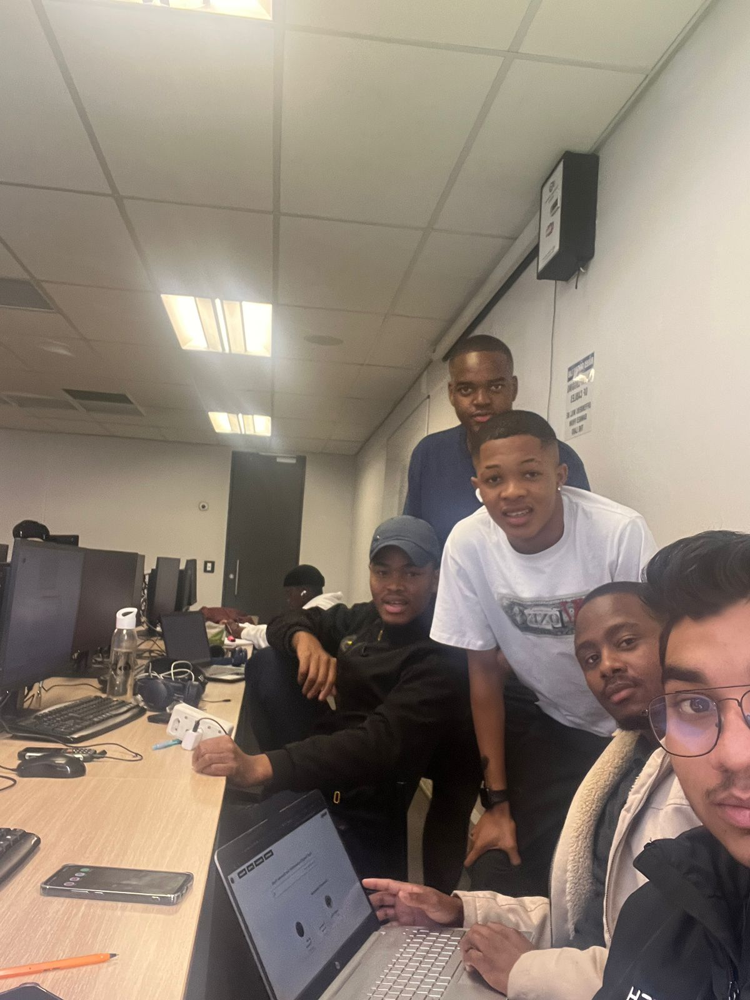

# Objectives

1. Design complete UML diagrams  
2. Final bug testing and integration  
3. Prepare for client demo  

## Design complete UML diagrams

UML diagrams were created to reflect the final system:

- Class Diagrams for database models.
- Use Case Diagrams for user interaction flows.
- Sequence Diagrams for messaging and application submission.

Tools used: Draw.io and Lucidchart.

## Final bug testing and integration

Each team member tested assigned modules.

- Fixed edge-case bugs in messaging and application logic.
- Ran end-to-end tests and performance checks on Azure.

## Prepare for client demo

A final demo presentation was prepared:

- Walkthrough of major features: reporting, messaging, filtering, applications.
- Admin panel and database demo on Azure Portal.
- Client feedback was noted for post-project improvements.

## Evidence
