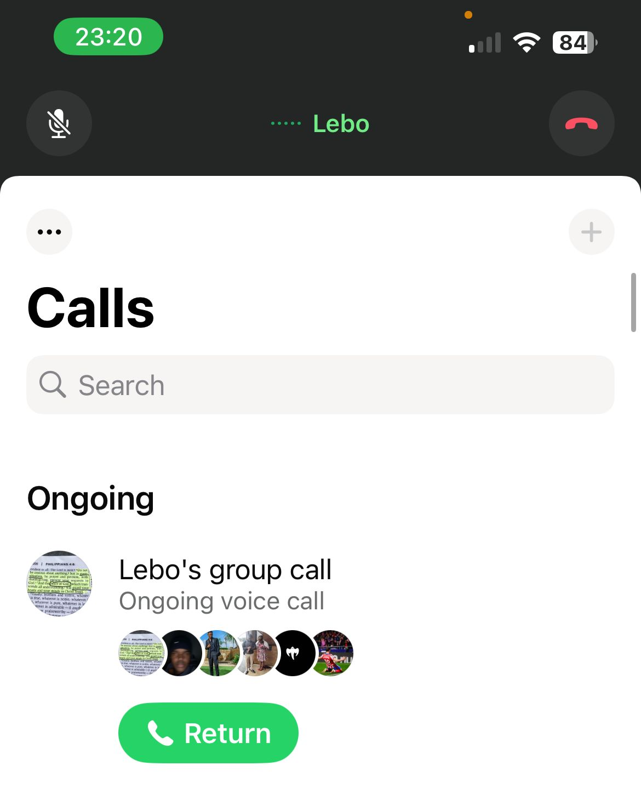

# Scrum 3

## Objectives
1. View List of Users (Admin)
2. Filter Users by Freelancer (Admin)

## View List of Users (Admin)

As an administrator, I want to go to the list of users' page, so that I can see all the users in the system.

**UAT**

Given I am logged in as an administrator, when I navigate to the "Users" section in the admin panel, then I should see a list of all users in the system.

## Filter Users by Freelancer (Admin)

As an administrator, I want to be able to filter the list of users by their role (freelancer or client) on the users list page, so that I can easily manage and view specific user groups.

**Freelancer Test Case**

Given I am on the users list page in the admin panel. When I select "Freelancer" from the role filter. Then the list should only display users with the "Freelancer" role.

## Evidence

