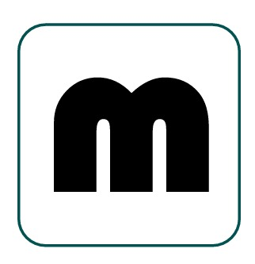

---

# **Managrs – Revolutionizing Freelance Collaboration**

---

## 🚀 The Future of Freelancing Starts Here

**Managrs** redefines how freelancers and clients collaborate in the digital workspace. We go beyond matching skills to projects — we build a connected ecosystem where productivity thrives, payments flow seamlessly, and professional relationships are nurtured with transparency and trust.

---

## ✨ Core Features

### 🔐 Smart Identity Verification

A secure three-tiered system designed for transparency and accountability:

* **Freelancer Portal** – Showcase your skills, manage projects, and build your digital reputation.
* **Client Command Center** – Post jobs, manage teams, and track deliverables in a unified dashboard.
* **Admin Observatory** – Full oversight with tools for monitoring, moderation, and user verification.

---

### 💼 Dynamic Job Marketplace

* **Intelligent Listings** – Clients can create detailed job posts with custom fields and attachments.
* **Discovery Engine** – Freelancers discover ideal opportunities with powerful filtering options.
* **Application Tracking** – Both sides enjoy clear visibility throughout the application lifecycle.

---

### 📋 Project Mission Control

* **Real-Time Progress** – Visual status indicators and progress bars keep everyone aligned.
* **Milestone Monitoring** – Stay on top of deliverables with structured tracking.

---

### 💰 Transparent Finance Hub

* **Milestone-Based Payments** – Funds are released securely as milestones are completed.
* **Direct Payments** – Support for flexible payment methods agreed upon by both parties (with optional platform moderation).

---

### 📊 Insightful Analytics

* **Financial Dashboard** – Visualize earnings, spending, and trends at a glance.
* **One-Click Reports** – Export clean, professional summaries in CSV or PDF format.

---

## 🌟 Enhanced User Experience

* **Auto Status Updates** – Git or repository activity reflects directly on project milestones.
* **Portfolio Automation** – Verified project completions enhance your profile automatically.

---

### 💬 Unified Communication

* **Threaded Project Chats** – Keep all conversations organized by topic and context.
* **Built-In Messaging** – Optional in-app chat for seamless collaboration without needing external tools.

---

### 🔔 Smart Notification System

* **Real-Time Alerts** – Stay informed with meaningful updates without the noise.

---

## 🛠️ Getting Started

👉 Check out the [Documentation](./Documentation/Running%20App.md) to set up Managrs on your local machine.

---

## 👥 Project Owners

* **Lebo Kharafu** - 2577390
* **Dimpho Matea** - 2678460
* **Lemohang Motsapi** - 2655576
* **Kagiso Kotu** - 2664847
* **Bhavan Domun** - 2601109
* **Kgaugelo Lebelo** - 2689690

*For any questions or collaboration, please reach out to the project owners.*

---

**Managrs** — Where talent meets opportunity, powered by trust.

---

